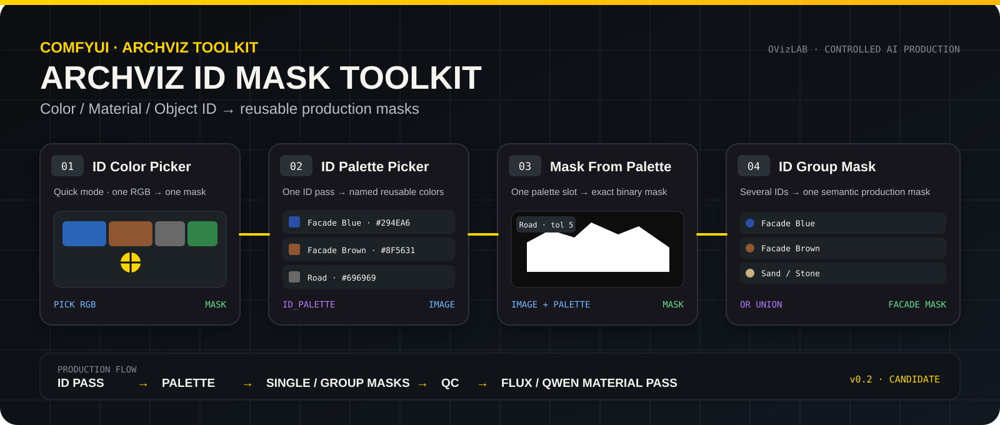

# ComfyUI · ARCHVIZ ID Mask Toolkit

  

**Status: PRODUCTION CANDIDATE · v0.2**

Deterministic Color ID / Material ID / Object ID masking for controlled architectural visualization workflows in ComfyUI.

> The current implementation is in branch **feat/id-mask-toolkit-v0.2**.  
> Draft PR: [#2 — Production Candidate: ARCHVIZ ID Mask Toolkit v0.2](https://github.com/lutiy-dev/ComfyUI-ARCHVIZ-ID-Mask/pull/2)

---

## Purpose

A 3D scene already knows which pixels belong to a material or object. When a clean ID pass exists, that scene truth is usually more reliable than asking an AI segmentation model to rediscover the same boundaries.

ARCHVIZ ID Mask Toolkit turns one ID pass into reusable single and grouped binary masks for downstream material replacement, refinement and compositing.

Main production flow:

~~~text
Color / Material / Object ID
            ↓
ARCHVIZ · ID Palette Picker
            ↓
      reusable palette
       ↙           ↘
Mask From Palette   ID Group Mask
       ↓                 ↓
  single mask        grouped mask
       └───────┬─────────┘
               ↓
      FLUX / Qwen / material pass
               ↓
          Masked Composite
               ↓
               QC
~~~

No VLM, SAM, GroundingDINO or external segmentation model is required when the 3D scene already provides exact IDs.

---

# Nodes

## 1 · ARCHVIZ · ID Color Picker Mask

**Quick mode: one picked RGB color → one deterministic binary mask.**

Use it when you need one region and do not need a reusable palette.

### Input
- **image : IMAGE**

### Controls
- **PICK COLOR** — activates the in-node eyedropper.
- **Red / Green / Blue** — selected RGB values.
- **Tolerance** — accepted RGB distance around the selected color.
- **Sample Radius**
  - 0 = one exact pixel
  - 1 = average 3×3
  - 2 = average 5×5
- **Invert** — reverses black/white output.
- **ID / MASK** — local QC preview mode.

### Outputs
- **MASK**
- **PREVIEW**
- **R**
- **G**
- **B**
- **HEX**

Recommended clean-ID baseline:

~~~text
Tolerance = 5
Sample Radius = 0
Invert = OFF
~~~

---

## 2 · ARCHVIZ · ID Palette Picker

**Production mode: one ID pass → reusable named RGB palette.**

This is the main node for multi-mask workflows.

Instead of loading or sampling the same ID image repeatedly, pick the required scene colors once and reuse them downstream.

### Input
- **image : IMAGE**

### Workflow
1. Press **+ ADD COLOR**.
2. Click a region in the built-in ID preview.
3. The node reads the real RGB value.
4. RGB, HEX and swatch are stored in a new palette slot.
5. Rename the slot, for example:
   - Facade Blue
   - Facade Brown
   - Road_04
   - Tree_03
   - Windows

### Palette slot structure

~~~json
{
  "id": "stable-id",
  "name": "Facade Blue",
  "rgb": [41, 78, 166],
  "hex": "#294EA6"
}
~~~

### Controls
- **Sample Radius**
  - 0 = 1×1
  - 1 = 3×3 average
  - 2 = 5×5 average

### Outputs
- **ARCHVIZ_ID_PALETTE**
- passthrough **IMAGE**

### Persistence behavior

The palette is serialized with the ComfyUI workflow.

Verified behavior:
- save/reload preserves the palette;
- renaming keeps the same stable color ID;
- downstream selectors refresh after rename;
- deleted colors are removed from grouped selections;
- the palette is not browser-only state.

---

## 3 · ARCHVIZ · Mask From Palette

**One palette slot → one binary production mask.**

Use multiple copies of this node for independent regions such as:

- Road
- Sidewalk
- Greenery
- Glass
- Roof
- Water
- individual facade materials

### Inputs
- **image : IMAGE**
- **palette : ARCHVIZ_ID_PALETTE**

### Controls
- **Palette Color** — select one named palette slot.
- **Tolerance** — RGB distance threshold.
- **Invert** — invert output.

### Outputs
- **MASK**
- **PREVIEW**
- **HEX**

Example:

~~~text
ID Palette
   ↓
Mask From Palette
Color = Road_04
Tolerance = 5
   ↓
ROAD MASK
~~~

One palette can feed many Mask From Palette nodes.

---

## 4 · ARCHVIZ · ID Group Mask

**Several ID colors → one semantic production mask.**

A real production scene often uses several material/object IDs for one logical processing category.

Example:

~~~text
Facade Blue
Facade Brown
Stone Arch
Sand Wall
      ↓
   logical OR
      ↓
 FACADE MASK
~~~

The node does **not** average RGB values.

Every selected color is matched independently, then all resulting masks are combined with logical OR.

### Inputs
- **image : IMAGE**
- **palette : ARCHVIZ_ID_PALETTE**

### Controls
- **Group Name** — Facade, Road, Greenery, etc.
- palette checklist — select any number of palette colors.
- **Tolerance**
- **Invert**
- **Refresh Palette**

### Outputs
- **MASK**
- **PREVIEW**
- **GROUP_NAME**

### Empty group behavior

~~~text
Invert OFF → black mask
Invert ON  → white mask
~~~

An unfinished group therefore does not break the graph.

---

# Mask extraction logic

The toolkit uses deterministic RGB distance matching.

For source pixel P and selected color S:

~~~text
distance² =
(Pr - Sr)² +
(Pg - Sg)² +
(Pb - Sb)²

hit when:
distance² <= tolerance²
~~~

Frontend picking and backend extraction use the same **8-bit RGB domain: 0..255**.

This is important: the color you click is the same color space used by the actual backend MASK calculation.

---

# Tolerance

Suggested starting values:

~~~text
0   exact RGB only
5   strict production baseline
10  small anti-alias variation
20  broader capture
~~~

Use the smallest tolerance that correctly captures the required ID region.

**Recommended source format: PNG.**

JPEG compression may create neighboring colors that were not present in the original ID pass.

---

# Scene Truth principle

These nodes perform **ID extraction**, not mask modification.

The following operations are intentionally not part of the toolkit:

- Blur
- Feather
- Grow
- Erode
- Dilate
- semantic AI segmentation
- object detection

Those belong downstream.

Keeping extraction and modification separate makes the workflow easier to debug and keeps the original 3D ID pass as the geometry truth source.

---

# Installation

## v0.2 Production Candidate branch

From **ComfyUI/custom_nodes**:

~~~bash
git clone -b feat/id-mask-toolkit-v0.2 https://github.com/lutiy-dev/ComfyUI-ARCHVIZ-ID-Mask.git
~~~

Restart ComfyUI.

Nodes appear under:

~~~text
ARCHVIZ / Masking
~~~

## Update an existing installation

~~~bash
cd ComfyUI-ARCHVIZ-ID-Mask
git pull
~~~

Restart ComfyUI after frontend updates.

---

# Example stress-test workflow

The candidate branch contains:

~~~text
example_workflows/
└── ARCHVIZ_ID_MASK_TOOLKIT_STRESS_TEST_v0.2.json

example_assets/
└── ARCHVIZ_ID_STRESS_TEST.png
~~~

Test graph:

~~~text
Load Image
    ↓
ID Palette Picker
    ├── Mask From Palette → Road → Preview
    ├── Mask From Palette → Greenery → Preview
    └── ID Group Mask → Facade → Preview
~~~

This test pack is intended to reproduce the core behavior before connecting the toolkit to a larger production graph.

---

# Validation status

## VERIFIED

The current v0.2 candidate has passed:

- GitHub CI;
- node registration in a real ComfyUI runtime;
- synthetic stress-test workflow;
- real architectural ID-pass test;
- palette color picking;
- RGB / HEX slot update;
- rename propagation;
- delete propagation;
- save/reload persistence;
- single-color masks;
- grouped OR masks;
- Invert;
- Tolerance 0 and 20;
- source-resolution preservation in tested runs.

## NOT YET CONFIRMED

Before final **PRODUCTION** status:

- integration into the full ARCHVIZ material workflow;
- dedicated Reroute runtime acceptance;
- Comfy Registry/API publication.

Current gate:

**PRODUCTION CANDIDATE**

---

# Recommended production architecture

~~~text
3ds Max / Corona
      ↓
Color / Material / Object ID
      ↓
ARCHVIZ ID Palette
      ↓
single / grouped masks
      ↓
Facade / Road / Greenery / Glass branches
      ↓
FLUX / Qwen material refinement
      ↓
Masked Composite
      ↓
QC / Accept / Reject
~~~

Core rule:

> If the 3D scene already knows the exact material/object boundary, use scene truth first. AI segmentation should be a fallback, not the default.

---

# Requirements

- ComfyUI
- Python 3.10+
- NumPy
- PyTorch
- Pillow

No external AI model is required.

---

# Repository verification

~~~bash
python -m unittest discover -s tests -v
python -m py_compile __init__.py nodes.py mask_core.py palette_core.py
node --check web/id_color_picker.js
node --check web/id_palette_system.js
~~~

---

# Version

~~~text
v0.2.0
Status: PRODUCTION CANDIDATE
~~~

The next milestone is full integration into the main ARCHVIZ production workflow.

---

# License

This project is released under the **MIT License**.

See [LICENSE](LICENSE) for the full text.
